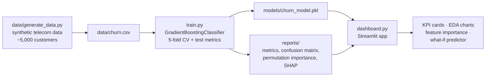

# churn-x — Customer Churn Prediction with Explainability

Predict which telecom customers are likely to churn, **and explain why** — so a
retention team can act on it, not just score it.

Built end-to-end: synthetic data generation → Gradient Boosting classifier →
permutation-importance / SHAP explainability → an interactive Streamlit
dashboard with a what-if churn simulator.

## Architecture



## Problem statement

Customer acquisition is expensive; keeping an existing customer is far cheaper.
The goal is to flag at-risk customers **early** (high recall on churners) while
keeping false alarms low enough that retention offers stay economical — and to
surface *which factors* drive each prediction so interventions can be targeted
(e.g. contract upgrade offers for month-to-month fibre customers with repeated
support calls).

## Project structure

```
churn-x/
├── data/
│   └── generate_data.py      # synthetic dataset generator → data/churn.csv
├── train.py                  # training, CV, metrics, explainability
├── dashboard.py              # Streamlit dashboard + what-if simulator
├── models/
│   ├── churn_model.pkl       # fitted sklearn pipeline (built by train.py)
│   └── feature_names.json
├── reports/
│   ├── metrics.json
│   ├── confusion_matrix.png
│   ├── roc_pr_curves.png
│   ├── permutation_importance.png / .csv
│   ├── shap_summary.png      # only if `shap` is installed
│   └── classification_report.txt
├── requirements.txt
└── README.md
```

## How to run

```bash
# 1. Create a virtual environment and install dependencies
python -m venv .venv
source .venv/bin/activate
pip install -r requirements.txt

# 2. Generate the synthetic dataset (~5,000 rows)
python data/generate_data.py

# 3. Train the model (writes models/ and reports/)
python train.py

# 4. Launch the dashboard
streamlit run dashboard.py
```

## Sample metrics

Representative run on the default seed (`--seed 42`):

| Metric              | Value |
|---------------------|-------|
| Test ROC-AUC        | 0.839 |
| Test F1             | 0.604 |
| Test precision      | 0.717 |
| Test recall         | 0.522 |
| 5-fold CV ROC-AUC   | 0.852 ± 0.011 |

*(Exact numbers vary slightly with the environment; see `reports/metrics.json`
after running `train.py`.)*

Top churn drivers found by permutation importance: **contract type
(month-to-month), tenure, support calls, monthly charges, tech support** —
matching the data-generating process.

## Explainability

- **Permutation importance** (always produced): ranks features by how much
  shuffling each one degrades ROC-AUC on the test set.
- **SHAP summary** (if `shap` is installed): per-prediction feature attributions
  for the tree model.
- **What-if simulator** (dashboard): perturb one customer's features against a
  typical-customer baseline and see which factors push their churn probability
  up or down.

## Notes

- The dataset is **fully synthetic** — no real customer data.
- No external APIs are used; everything runs locally.
